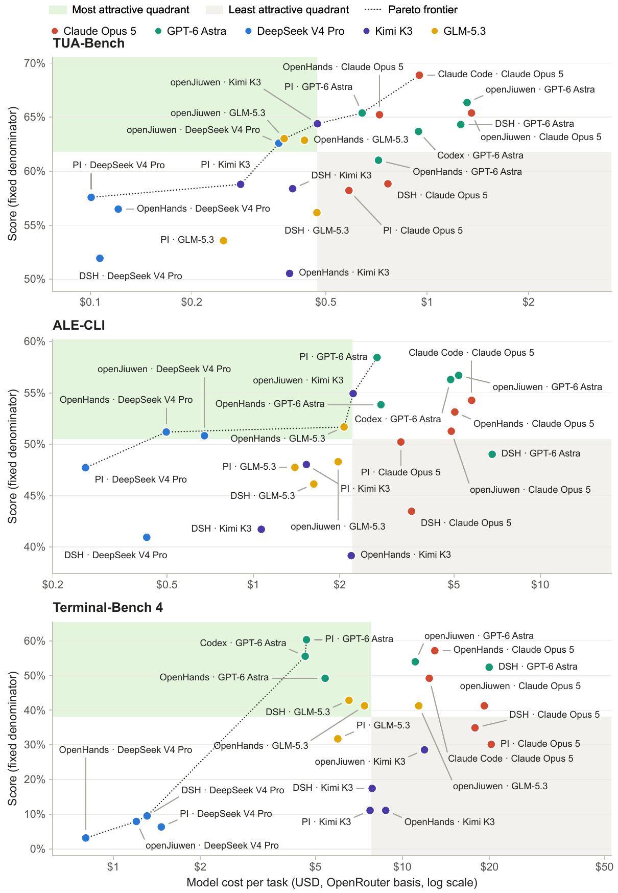

<h1 align="center">Finding the Right Fit</h1>
<p align="center"><b>A Harness × Model evaluation suite for command-line agents</b></p>

<p align="center">
  <a href="https://arxiv.org/abs/XXXX.XXXXX"></a>
  <a href="https://huggingface.co/datasets/yixuanli97/finding-the-right-fit"></a>
  <a href="LICENSE"></a>
</p>

Which harness should run your model? A model that tops one agent framework can fall far
behind in another, and the best harness for a model changes with the task. This repository
lets you measure that directly: it runs **any of six agent harnesses with any
OpenRouter model on three command-line agent benchmarks**, under one configuration, one
scoring rule and one cost ledger. It is the code behind the paper
[*Finding the Right Fit: Model–Harness Interactions across Agent Tasks*](https://arxiv.org/abs/XXXX.XXXXX).

- **6 harnesses, ready to run.** OpenHands, DeepSeek Harness (DSH), PI, openJiuwen,
  Codex and Claude Code, each wired to Harbor (TUA-Bench, Terminal-Bench 4) and to the
  ALE runner (ALE-CLI). No adapter code to write.
- **Any model, fair routing.** Every model goes through OpenRouter, pinned to its
  first-party provider with fallbacks disabled, with high reasoning effort and each
  harness's own defaults.
- **3 CLI benchmarks.** TUA-Bench (120 general terminal tasks), ALE-CLI (99 professional
  workflows), Terminal-Bench 4 (63 hard command-line tasks).
- **Comparable numbers.** Fixed task denominators, one counted run per task, and
  per-generation cost reconciliation against OpenRouter.
- **Open trajectories.** All 6,204 scored runs from the paper, converted to one chat-style
  format with per-call token usage, cost and timing, on the
  [Hugging Face dataset](https://huggingface.co/datasets/yixuanli97/finding-the-right-fit).

## Results from the paper

66 configurations: four configurable harnesses × five models × three benchmarks, plus the
native Codex–GPT and Claude Code–Claude pairings. Bold marks the best harness for each
model on each benchmark.

<p align="center">
  
</p>
<p align="center"><i>Score versus cost per task for every configuration (Figure 1 of the paper).
Shaded quadrants split each benchmark at the median cost and median score; the dotted line is
the Pareto frontier.</i></p>

**TUA-Bench** (score %, cost per task in USD)

| Model | OpenHands | DSH | PI | openJiuwen | Native |
|---|---:|---:|---:|---:|---:|
| Claude Opus 5 | 65.2 / $0.72 | 58.8 / $0.76 | 58.2 / $0.59 | 65.4 / $1.35 | **68.9 / $0.95** |
| GPT-6 Astra | 61.0 / $0.72 | 64.3 / $1.26 | 65.4 / $0.64 | **66.3 / $1.31** | 63.7 / $0.94 |
| GLM-5.3 | 62.9 / $0.43 | 56.2 / $0.47 | 53.6 / $0.25 | **63.0 / $0.38** | – |
| Kimi K3 | 50.5 / $0.39 | 58.4 / $0.40 | 58.8 / $0.28 | **64.4 / $0.47** | – |
| DeepSeek V4 Pro | 56.5 / $0.12 | 51.9 / $0.11 | 57.6 / $0.10 | **62.6 / $0.36** | – |

**ALE-CLI** (score %, cost per task in USD)

| Model | OpenHands | DSH | PI | openJiuwen | Native |
|---|---:|---:|---:|---:|---:|
| Claude Opus 5 | 53.1 / $5.03 | 43.5 / $3.56 | 50.2 / $3.27 | 51.3 / $4.89 | **54.3 / $5.76** |
| GPT-6 Astra | 53.9 / $2.78 | 49.0 / $6.79 | **58.5 / $2.70** | 56.7 / $5.19 | 56.3 / $4.87 |
| GLM-5.3 | **51.7 / $2.07** | 46.1 / $1.62 | 47.7 / $1.40 | 48.3 / $1.97 | – |
| Kimi K3 | 39.1 / $2.19 | 41.7 / $1.07 | 48.0 / $1.53 | **54.9 / $2.23** | – |
| DeepSeek V4 Pro | **51.2 / $0.50** | 40.9 / $0.42 | 47.7 / $0.26 | 50.8 / $0.68 | – |

**Terminal-Bench 4** (score %, cost per task in USD)

| Model | OpenHands | DSH | PI | openJiuwen | Native |
|---|---:|---:|---:|---:|---:|
| Claude Opus 5 | **57.1 / $12.93** | 34.9 / $17.82 | 30.2 / $20.28 | 41.3 / $19.19 | 49.2 / $12.38 |
| GPT-6 Astra | 49.2 / $5.40 | 52.4 / $19.94 | **60.3 / $4.66** | 54.0 / $11.07 | 55.6 / $4.61 |
| GLM-5.3 | 41.3 / $7.39 | **42.9 / $6.53** | 31.7 / $5.98 | 41.3 / $11.38 | – |
| Kimi K3 | 11.1 / $8.75 | 17.5 / $7.85 | 11.1 / $7.73 | **28.6 / $11.92** | – |
| DeepSeek V4 Pro | 3.2 / $0.80 | **9.5 / $1.31** | 6.3 / $1.47 | 7.9 / $1.20 | – |

The best harness changes across benchmarks for four of the five models, a model's own
vendor harness is not reliably its best, and higher cost does not reliably buy a higher
score. See the paper for the analysis and the trajectory case studies.

## What is in this repository

| Path | Contents |
|---|---|
| `integrations/` | Harness adapters: Harbor agents for TUA-Bench and Terminal-Bench (`harbor.py`, `harbor_deepseek.py`, `harbor_codex.py`, `harbor_openjiuwen.py`, `harbor_openjiuwen_tua.py`), ALE-CLI deployers for all six harnesses (`ale_agents/study_*`), the OpenRouter provider-routing injector, and the openJiuwen coding-agent composition (`openjiuwen_agent.py`). |
| `experiment.yaml` | The configuration used in the paper: harness versions, per-model OpenRouter routes, reasoning effort, context and output limits, tools, timeouts and benchmark commits. |
| `experiment.py` | Command-line entry point: `setup`, `doctor`, `prepare`, `run`, `status`, `audit`. |
| `pilot/` | Campaign launch scripts, including the openJiuwen runs (`pilot/*openjiuwen*`). |
| `release_tools/` | Converters from each harness's native logs to the unified trajectory format. |
| `analysis/` | Scripts that build the results table and reproduce the paper's figures and cost tables. |

## Harnesses and models

| Harness | Version | TUA-Bench / Terminal-Bench 4 | ALE-CLI |
|---|---|---|---|
| OpenHands | Software Agent SDK, `openhands-tools` 1.44.1 | Harbor 0.22.0 | ALE runner |
| DeepSeek Harness (DSH) | `@deepseek-ai/dsh` 0.1.1-rc.2 | Harbor 0.22.0 | ALE runner |
| PI | `@earendil-works/pi-coding-agent` 0.84.4 | Harbor 0.22.0 | ALE runner |
| openJiuwen | `openjiuwen` 0.1.18, agent assembled from its public harness API | Harbor 0.22.0 | ALE runner |
| Codex | `@openai/codex` 0.150.1 (GPT only) | Harbor 0.22.0 | ALE runner |
| Claude Code | `@anthropic-ai/claude-code` 2.1.251 (Claude only) | Harbor 0.22.0 | ALE runner |

Models (OpenRouter ID, pinned provider): `anthropic/claude-opus-5` (Anthropic),
`openai/gpt-6-astra` (OpenAI), `moonshotai/kimi-k3` (Moonshot AI),
`deepseek/deepseek-v4-pro-0813` (DeepSeek), `z-ai/glm-5.3` (Z.ai). Adding another
OpenRouter model means adding one entry to `experiment.yaml`.

Benchmarks: TUA-Bench (commit `3497fd32`), ALE-CLI (commit `0b6465b1`, the 99 tasks that
run in the local Docker sandbox), Terminal-Bench 4 (v4.0.0, 63-task non-H100 subset).

## Quick start

Requirements: Linux with Docker, [uv](https://docs.astral.sh/uv/), and an OpenRouter API
key. ALE-CLI also needs its pinned local image (about 100 GB) and the gated ALE task data,
which you must request from the ALE authors and use under their terms.

```bash
cp .env.example .env                 # add OPENROUTER_API_KEY; never commit it
cp local.yaml.example local.yaml     # machine-local concurrency and ALE settings
uv run --frozen python experiment.py setup --harness openhands
uv run --frozen python experiment.py doctor --harness openhands \
  --benchmark terminal-bench-4 --benchmark tua-bench --benchmark ale-cli
```

`setup` makes no model calls; it fetches the pinned Harbor, Terminal-Bench, TUA-Bench and
ALE sources. Harness IDs: `openhands`, `deepseek-harness`, `pi`, `codex`, `claude-code`.

Paid runs are guarded. `prepare` writes an immutable manifest and refuses to run until
`campaign.status` in `experiment.yaml` is set from `draft` to `ready`; `run` only starts a
manifest whose SHA-256 you pass back:

```bash
uv run --frozen python experiment.py prepare \
  --run-id my-openhands-r1 --harness openhands --model all --benchmark all
uv run --frozen python experiment.py run \
  --manifest runs/my-openhands-r1/manifest.json \
  --approved-manifest-sha256 <sha256 printed by prepare>
uv run --frozen python experiment.py status --manifest runs/my-openhands-r1/manifest.json
```

Run a subset by fixing one benchmark and listing task IDs:

```bash
uv run --frozen python experiment.py prepare \
  --run-id my-pi-ale-shard-001 --harness pi --model all \
  --benchmark ale-cli --task computing_math/os_log_permission_guard_v1
```

After a run, `experiment.py audit --manifest ... --fetch-provider` reconciles costs with
OpenRouter's per-generation records without making model calls. Raw run folders are never
overwritten; reruns use a new run ID.

openJiuwen is a framework rather than a packaged agent, so it is not an `experiment.py`
harness ID. Its runs use `integrations/harbor_openjiuwen.py` (Terminal-Bench),
`integrations/harbor_openjiuwen_tua.py` (TUA-Bench) and
`integrations/ale_agents/study_openjiuwen` (ALE-CLI), launched by the `pilot/*openjiuwen*`
scripts; the agent composition is in `integrations/openjiuwen_agent.py`.

## Trajectory dataset

The [Hugging Face dataset](https://huggingface.co/datasets/yixuanli97/finding-the-right-fit) contains the per-task results table and one
trajectory per scored run (6,204 runs: 66 configurations × their task sets), each with the
full model–tool conversation, reward, cost, token usage and agent time. It is meant for
analyzing agent behavior, comparing harnesses and other research on evaluation. Please do
not use it to train, fine-tune or distill models; the benchmarks behind it ask the same.

## Reproducing the paper's figures

Download `results/task_level.tsv` and `results/config_cost_summary.csv` from the dataset into
`analysis/data/` (the scripts read these file names), then run for example:

```bash
cd analysis
python3 plot_score_cost_paper.py          # score versus cost per task (Figure 1)
python3 plot_resource_profile_paper.py    # resource-use profile (appendix)
python3 make_cost_tables.py               # cost table (appendix)
```

`analysis/extract_*.py` and `analysis/build_*.py` rebuild the results table from raw run
folders (set `RUNS_ROOT`), and `release_tools/convert_*.py` rebuild the trajectory files.

## Citation

If you use this code or the dataset, please cite:

```bibtex
@article{li2026rightfit,
  title   = {Finding the Right Fit: Model--Harness Interactions across Agent Tasks},
  author  = {Li, Yixuan and Zhou, Yiyun and Teng, Yao Long and Yang, Fuchao and Deng, Yanchen and
             Lyu, Zhiyi and Dong, Xuyu and Chen, Feng and An, Bo},
  journal = {arXiv preprint arXiv:XXXX.XXXXX},
  year    = {2026},
  url     = {https://arxiv.org/abs/XXXX.XXXXX}
}
```

## License

Code: Apache License 2.0. The benchmarks and harnesses keep their own licenses. The
dataset has separate terms; see its card.
